# Laboratorio 8 — Infraestructura como Código con Terraform (Azure)

**Curso:** ARSW
**Estudiante:** Ignacio Castillo  

---

## Descripción

Despliegue de una arquitectura de alta disponibilidad en Azure usando **Terraform**, compuesta por un **Load Balancer público (L4)** que distribuye tráfico HTTP entre **2 VMs Linux** con **nginx**, dentro de una **Virtual Network** segmentada con **NSG**.

## Arquitectura desplegada

| Recurso | Nombre |
|---|---|
| Resource Group | `lab8-rg` |
| Virtual Network | `lab8-vnet` (10.10.0.0/16) |
| Subnet Web | `subnet-web` (10.10.1.0/24) |
| Subnet Mgmt | `subnet-mgmt` (10.10.2.0/24) |
| Load Balancer | `lab8-lb` (SKU Standard) |
| IP Pública | `lab8-lb-pip` (Static) |
| VM 0 | `lab8-vm-0` (Ubuntu 22.04 LTS) |
| VM 1 | `lab8-vm-1` (Ubuntu 22.04 LTS) |
| NSG | `lab8-web-nsg` |
| Backend Pool | `lab8-bepool` |
| Health Probe | `http-80` (TCP/80) |
| LB Rule | `http-80` (80 → 80) |

## Estructura del repositorio

```text
.
├── infra/
│   ├── main.tf                  # Resource Group y llamadas a módulos
│   ├── providers.tf             # Provider azurerm y backend remoto
│   ├── variables.tf             # Variables de entrada
│   ├── outputs.tf               # Outputs (IP del LB, nombres de VMs)
│   ├── cloud-init.yaml          # Instalación de nginx en las VMs
│   ├── backend.hcl.example      # Ejemplo de configuración del backend
│   └── env/
│       └── dev.tfvars           # Variables del entorno dev
├── modules/
│   ├── vnet/                    # Módulo de red (VNet + subnets)
│   │   ├── main.tf
│   │   ├── variables.tf
│   │   └── outputs.tf
│   ├── compute/                 # Módulo de cómputo (NICs + VMs)
│   │   ├── main.tf
│   │   ├── variables.tf
│   │   └── outputs.tf
│   └── lb/                      # Módulo de Load Balancer + NSG
│       ├── main.tf
│       ├── variables.tf
│       └── outputs.tf
├── .github/
│   └── workflows/
│       └── terraform.yml        # Pipeline CI/CD con GitHub Actions
└── README.md
```

## Requisitos previos

- Cuenta Azure (Azure for Students)
- Azure CLI (`az`) instalado
- Terraform >= 1.6 instalado
- SSH key generada (`ssh-keygen -t ed25519`)

## Paso a paso del despliegue

### 1. Bootstrap del backend remoto

Crear el Storage Account para almacenar el state de Terraform:

```bash
az login
az account set --subscription "<SUBSCRIPTION_ID>"

az group create -n rg-tfstate-lab8 -l centralus
az storage account create -g rg-tfstate-lab8 -n sttfstatelab8ignacio -l centralus --sku Standard_LRS --encryption-services blob
az storage container create --name tfstate --account-name sttfstatelab8ignacio
```

### 2. Configurar `backend.hcl`

Copiar `backend.hcl.example` a `backend.hcl` con los valores reales:

```hcl
resource_group_name  = "rg-tfstate-lab8"
storage_account_name = "sttfstatelab8ignacio"
container_name       = "tfstate"
key                  = "lab8/terraform.tfstate"
```

### 3. Configurar variables de entorno (`dev.tfvars`)

```hcl
prefix              = "lab8"
location            = "centralus"
vm_count            = 2
admin_username      = "student"
ssh_public_key      = "~/.ssh/id_ed25519.pub"
allow_ssh_from_cidr = "X.X.X.X/32"

tags = {
  owner   = "ignaciocastillo05"
  course  = "ARSW/BluePrints"
  env     = "dev"
  expires = "2026-12-31"
}
```

### 4. Desplegar la infraestructura

```bash
cd infra
terraform init -backend-config=backend.hcl
terraform fmt -recursive
terraform validate
terraform plan -var-file=env/dev.tfvars -out plan.tfplan
terraform apply "plan.tfplan"
```

### 5. Verificar el Load Balancer

```bash
curl http://<LB_PUBLIC_IP>
```

Refrescar varias veces para ver la respuesta alternando entre `lab8-vm-0` y `lab8-vm-1`.

## Decisiones técnicas y trade-offs

- Región `centralus`: se eligió porque `eastus` y `eastus2` no tenían disponibilidad del SKU de VM.
- VM Size `Standard_D2s_v3`: se usó porque los tamaños B-series (`Standard_B1s`) no estaban disponibles en las regiones probadas. Los SKUs B-series con `p` son ARM64 y no son compatibles con la imagen Ubuntu x64.
- Load Balancer L4 (Standard): se eligió L4 sobre Application Gateway (L7) por simplicidad y menor costo. L7 sería necesario si se requiere routing por path o terminación SSL.
- NSG por NIC: el NSG se asocia directamente a las NICs en lugar de a la subnet, permitiendo reglas granulares por VM si fuera necesario.
- SSH restringido: la regla SSH solo permite acceso desde una IP específica (CIDR /32) para minimizar la superficie de ataque.
- Backend remoto: el state se almacena en Azure Blob Storage con locking para evitar conflictos en equipos.

## Seguridad

| Regla NSG | Puerto | Origen | Propósito |
|---|---|---|---|
| Allow-HTTP-Internet | 80/TCP | * | Tráfico web al LB |
| Allow-SSH-From-Home | 22/TCP | IP específica /32 | Administración SSH |

- Autenticación SSH por clave pública, sin contraseña.
- Tags de expiración para control de costos.
- Sin IPs públicas directas en las VMs.

## CI/CD con GitHub Actions

El workflow `.github/workflows/terraform.yml` ejecuta:

- En cada PR: `fmt`, `validate`, `plan`.
- Manual (`workflow_dispatch`): `apply` con aprobación.
- Autenticación mediante OIDC, sin secretos de larga duración.

### Diagrama de componentes

┌─────────────────────────────────────────────────────────────────────┐
│                         Azure (centralus)                          │
│                                                                     │
│  ┌───────────────────────────────────────────────────────────────┐  │
│  │                    Resource Group: lab8-rg                    │  │
│  │                                                               │  │
│  │   ┌─────────────┐                                            │  │
│  │   │  Public IP   │                                            │  │
│  │   │ lab8-lb-pip  │                                            │  │
│  │   └──────┬───────┘                                            │  │
│  │          │                                                     │  │
│  │   ┌──────▼────────────────────────────┐                       │  │
│  │   │     Load Balancer: lab8-lb        │                       │  │
│  │   │     (Standard SKU - L4)           │                       │  │
│  │   │                                    │                       │  │
│  │   │  Frontend: Public (port 80)       │                       │  │
│  │   │  Health Probe: TCP/80             │                       │  │
│  │   │  Rule: 80 -> 80                   │                       │  │
│  │   │  Backend Pool: lab8-bepool        │                       │  │
│  │   └──────┬───────────────┬────────────┘                       │  │
│  │          │               │                                     │  │
│  │   ┌──────▼───────────────▼────────────────────────────────┐   │  │
│  │   │          VNet: lab8-vnet (10.10.0.0/16)               │   │  │
│  │   │                                                        │   │  │
│  │   │  ┌─────────────────────────────────────────────────┐  │   │  │
│  │   │  │         subnet-web (10.10.1.0/24)               │  │   │  │
│  │   │  │                                                  │  │   │  │
│  │   │  │  ┌──────────────────┐  ┌──────────────────┐     │  │   │  │
│  │   │  │  │   lab8-vm-0      │  │   lab8-vm-1      │     │  │   │  │
│  │   │  │  │   Ubuntu 22.04  │  │   Ubuntu 22.04   │     │  │   │  │
│  │   │  │  │   nginx         │  │   nginx          │     │  │   │  │
│  │   │  │  │   D2s_v3        │  │   D2s_v3         │     │  │   │  │
│  │   │  │  │   ┌───────────┐ │  │   ┌───────────┐  │     │  │   │  │
│  │   │  │  │   │ lab8-nic-0│ │  │   │ lab8-nic-1│  │     │  │   │  │
│  │   │  │  │   └───────────┘ │  │   └───────────┘  │     │  │   │  │
│  │   │  │  └──────────────────┘  └──────────────────┘     │  │   │  │
│  │   │  └─────────────────────────────────────────────────┘  │   │  │
│  │   │                                                        │   │  │
│  │   │  ┌─────────────────────────────────────────────────┐  │   │  │
│  │   │  │         subnet-mgmt (10.10.2.0/24)              │  │   │  │
│  │   │  │         (reservada para Bastion/salto)          │  │   │  │
│  │   │  └─────────────────────────────────────────────────┘  │   │  │
│  │   └────────────────────────────────────────────────────────┘   │  │
│  │                                                               │  │
│  │   ┌────────────────────────────────┐                          │  │
│  │   │   NSG: lab8-web-nsg           │                          │  │
│  │   │   Rule 100: HTTP 80 (any)     │                          │  │
│  │   │   Rule 110: SSH 22 (mi IP)    │                          │  │
│  │   └────────────────────────────────┘                          │  │
│  └───────────────────────────────────────────────────────────────┘  │
│                                                                     │
│  ┌───────────────────────────────────────────────────────────────┐  │
│  │              Resource Group: rg-tfstate-lab8                  │  │
│  │   ┌─────────────────────────────────────────┐                │  │
│  │   │  Storage Account: sttfstatelab8ignacio  │                │  │
│  │   │  Container: tfstate                      │                │  │
│  │   │  Blob: lab8/terraform.tfstate            │                │  │
│  │   └─────────────────────────────────────────┘                │  │
│  └───────────────────────────────────────────────────────────────┘  │
└─────────────────────────────────────────────────────────────────────┘

### Diagrama de secuencia

# Flujo de despliegue

  Estudiante          Azure CLI         Terraform           Azure              GitHub Actions
      │                   │                 │                  │                      │
      │  az login         │                 │                  │                      │
      │──────────────────>│                 │                  │                      │
      │                   │  autenticar     │                  │                      │
      │                   │────────────────────────────────────>                      │
      │                   │                 │                  │                      │
      │  az group create  │                 │                  │                      │
      │  az storage ...   │                 │                  │                      │
      │──────────────────>│  crear RG +     │                  │                      │
      │                   │  Storage Account│                  │                      │
      │                   │────────────────────────────────────>                      │
      │                   │                 │                  │                      │
      │  terraform init   │                 │                  │                      │
      │─────────────────────────────────────>                  │                      │
      │                   │                 │  conectar state  │                      │
      │                   │                 │─────────────────>│                      │
      │                   │                 │  state OK        │                      │
      │                   │                 │<─────────────────│                      │
      │                   │                 │                  │                      │
      │  terraform plan   │                 │                  │                      │
      │─────────────────────────────────────>                  │                      │
      │                   │                 │  calcular diff   │                      │
      │                   │                 │─────────────────>│                      │
      │                   │                 │  plan: 18 add    │                      │
      │<─────────────────────────────────────                  │                      │
      │                   │                 │                  │                      │
      │  terraform apply  │                 │                  │                      │
      │─────────────────────────────────────>                  │                      │
      │                   │                 │  1. crear RG     │                      │
      │                   │                 │─────────────────>│                      │
      │                   │                 │  2. crear VNet   │                      │
      │                   │                 │─────────────────>│                      │
      │                   │                 │  3. crear subnets│                      │
      │                   │                 │─────────────────>│                      │
      │                   │                 │  4. crear NICs   │                      │
      │                   │                 │─────────────────>│                      │
      │                   │                 │  5. crear VMs    │                      │
      │                   │                 │─────────────────>│                      │
      │                   │                 │  6. crear PIP+LB │                      │
      │                   │                 │─────────────────>│                      │
      │                   │                 │  7. crear NSG    │                      │
      │                   │                 │─────────────────>│                      │
      │                   │                 │  8. asociaciones │                      │
      │                   │                 │─────────────────>│                      │
      │                   │                 │  guardar state   │                      │
      │                   │                 │─────────────────>│                      │
      │  Apply complete!  │                 │                  │                      │
      │  18 added         │                 │                  │                      │
      │<─────────────────────────────────────                  │                      │
      │                   │                 │                  │                      │
      │  curl http://LB_IP│                 │                  │                      │
      │─────────────────────────────────────────────────────── >                      │
      │  "Hola desde      │                 │     LB ────> VM0 │                      │
      │   lab8-vm-0"      │                 │         o── VM1  │                      │
      │<────────────────────────────────────────────────────────                      │
      │                   │                 │                  │                      │
      │  git push         │                 │                  │                      │
      │────────────────────────────────────────────────────────────────────────────── >
      │                   │                 │                  │       PR trigger     │
      │                   │                 │                  │       fmt+validate   │
      │                   │                 │                  │       +plan          │
      │                   │                 │                  │<──────────────────────
      │                   │                 │                  │                      │

# Flujo de request HTTP del usuario

  Usuario            Internet         Public IP        Load Balancer       VM-0 / VM-1
     │                  │                │                  │                   │
     │  GET http://     │                │                  │                   │
     │  20.29.54.208    │                │                  │                   │
     │─────────────────>│                │                  │                   │
     │                  │  TCP :80       │                  │                   │
     │                  │───────────────>│                  │                   │
     │                  │                │  forward         │                   │
     │                  │                │─────────────────>│                   │
     │                  │                │                  │  health probe OK  │
     │                  │                │                  │─────────────────> │
     │                  │                │                  │  round robin      │
     │                  │                │                  │  selecciona VM    │
     │                  │                │                  │─────────────────> │
     │                  │                │                  │                   │
     │                  │                │                  │  nginx responde   │
     │                  │                │                  │  "Hola desde      │
     │                  │                │                  │   lab8-vm-X"      │
     │                  │                │                  │<──────────────────│
     │                  │                │  response        │                   │
     │                  │                │<─────────────────│                   │
     │                  │  HTTP 200      │                  │                   │
     │                  │<───────────────│                  │                   │
     │  "Hola desde     │                │                  │                   │
     │   lab8-vm-X"     │                │                  │                   │
     │<─────────────────│                │                  │                   │
     │                  │                │                  │                   │


### Respuesta a preguntas

1. ¿Por qué L4 LB vs. Application Gateway (L7)? ¿Qué cambiaría?

Se eligió el Load Balancer L4 (Standard) porque el caso de uso es simple: distribuir tráfico HTTP (puerto 80) entre 2 VMs que sirven el mismo contenido. L4 opera a nivel de transporte (TCP/UDP), es más barato y tiene menor latencia.

Con Application Gateway (L7) se podría:

- Hacer routing por path, por ejemplo `/api` hacia unas VMs y `/web` hacia otras.
- Terminar SSL/TLS en el gateway en vez de en cada VM.
- Integrar WAF (Web Application Firewall) para proteger contra ataques OWASP como SQL injection o XSS.
- Usar cookie-based session affinity para sticky sessions.
- Reescribir headers y URLs.

Para este lab no se necesita nada de eso, así que L4 es la elección correcta por costo y simplicidad. Si se tuviera múltiples microservicios o se necesitara HTTPS con certificados, L7 sería la mejor opción.

2. ¿Qué implicaciones de seguridad tiene exponer 22/TCP? ¿Cómo mitigarlas?

Exponer SSH a Internet implica:

- Ser objetivo de ataques de fuerza bruta automatizados, porque bots escanean constantemente el puerto 22.
- Riesgo directo si la clave privada se compromete.
- Exposición a vulnerabilidades del servicio SSH si no está actualizado.

Mitigaciones implementadas en el lab:

- SSH por clave pública, sin contraseña, lo que hace inviable la fuerza bruta.
- NSG restringido por IP, permitiendo SSH solo desde una dirección específica (/32).

Mitigaciones adicionales para producción:

- Azure Bastion para evitar exponer el puerto 22.
- JIT (Just-In-Time) Access para abrir el puerto solo cuando se solicita y por tiempo limitado.
- Cambiar el puerto SSH a uno no estándar, como 2222, para reducir escaneos automáticos.
- Fail2ban para bloquear IPs después de intentos fallidos.
- VPN Point-to-Site o Site-to-Site para acceder a las VMs solo por una red privada.

3. ¿Qué mejoras harías si esto fuera producción?

Resiliencia:

- Usar VM Scale Set (VMSS) en lugar de VMs individuales, con autohealing.
- Distribuir las VMs en Availability Zones distintas para resistir fallos de datacenter.
- Replicar en múltiples regiones con Azure Traffic Manager o Front Door para disaster recovery.
- Usar health probes HTTP en vez de TCP para validar que la aplicación responde correctamente.

Autoscaling:

- Definir reglas de autoscale en el VMSS basadas en CPU, memoria o número de conexiones.
- Escalar horizontalmente en horas pico y reducir en horas de bajo tráfico para optimizar costos.
- Mantener al menos 3 instancias en producción para conservar disponibilidad durante escalado.

Observabilidad:

- Usar Azure Monitor con alertas en CPU, memoria, estado del health probe y latencia del LB.
- Centralizar logs en un Log Analytics Workspace.
- Agregar Application Insights si la app lo soporta.
- Configurar Budget Alerts para controlar costos.
- Crear dashboards en Azure Monitor o Grafana para visualización en tiempo real.

Seguridad adicional:

- Azure Bastion en lugar de SSH expuesto.
- HTTPS con certificados TLS usando Application Gateway o Front Door.
- Key Vault para gestionar secretos y certificados.
- Managed Identities en las VMs para acceder a recursos Azure sin credenciales hardcodeadas.
- Azure Policy para enforcement de compliance, por ejemplo tags obligatorios o regiones permitidas.

## Evidencias

### Paso 1: Evidencia inicial

Configuración inicial de Terraform y Azure de manera local para seguir con la implementación.

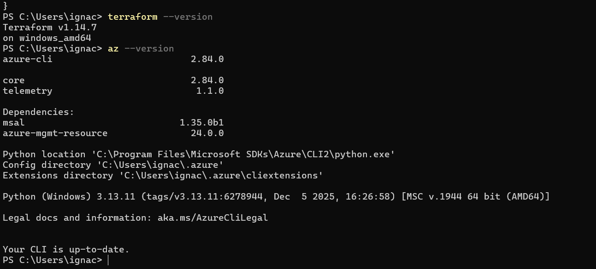

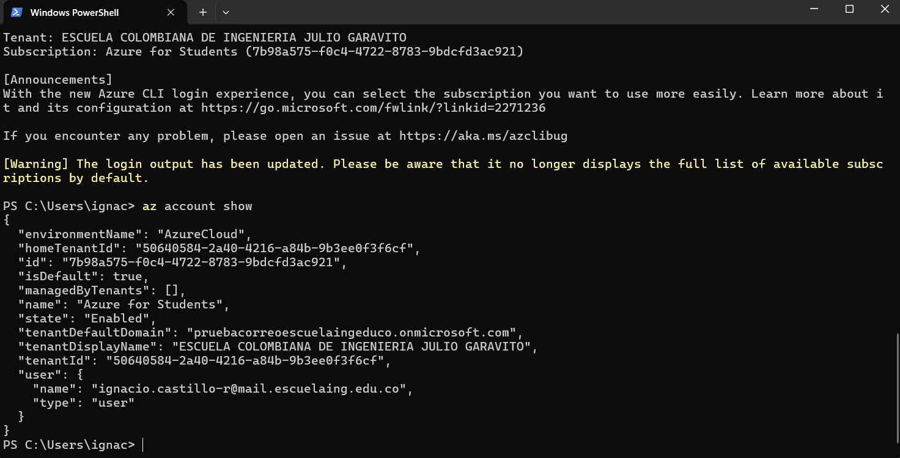

### Terraform state y backend remoto

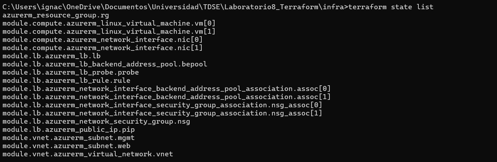

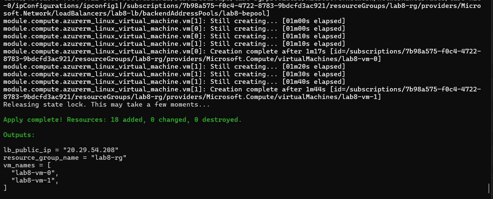

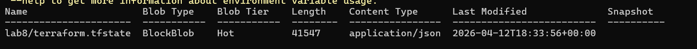

### Recursos desplegados

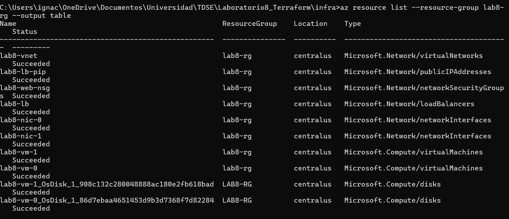

### VMs en ejecución

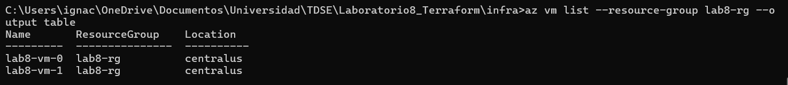

### Load balancer

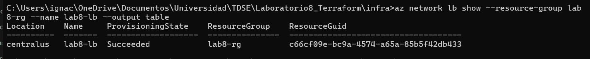

### Reglas de seguridad

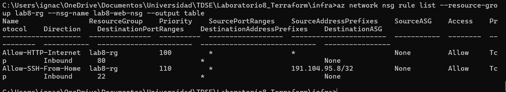

### Vnets y subredes

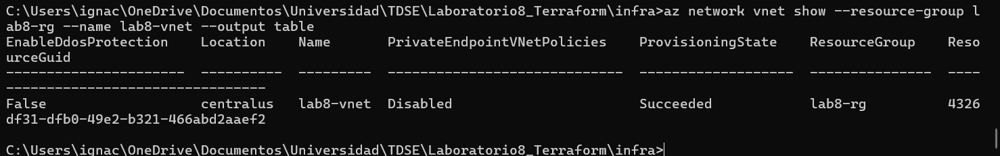

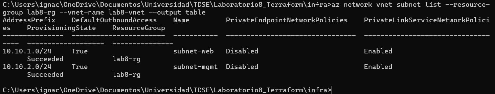

### Validación en ejecución

En las imágenes se puede ver que la respuesta va cambiando entre `vm0` y `vm1`; esto demuestra que el Load Balancer está distribuyendo el tráfico entre las 2 VMs.

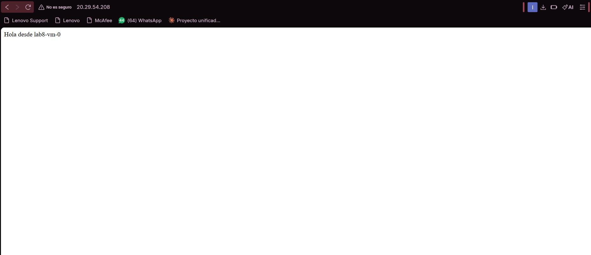

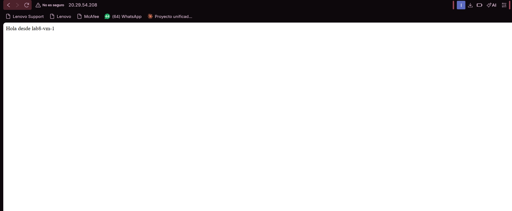